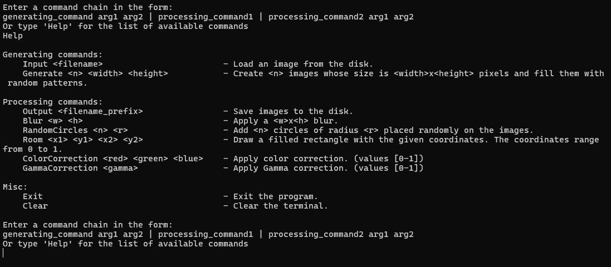
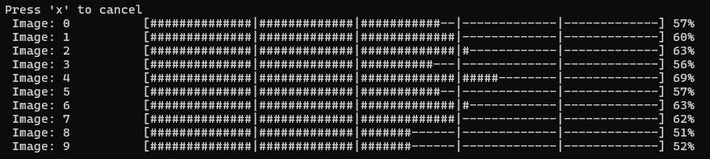

# MiniImageGenerator

## Description

MiniImageGenerator was developed as part of the Programming 3 - Advanced course during the winter semester of 2024/2025 academic year.

It aims to provide a compact interface for generating and/or processing images in a unique way.

## Running the program
Make sure to change the architecture to `x64`, then compile and run the project. You will be prompted to type a chain of commands, as illustrated, you may also type `Help` for help.

<p align="center">
  
</p>

Using the software involves typing the command chain from the list of available commands, separated by the `|` character, in the following format:

```
generating_command arg1 arg2 | processing_command1 | processing_command2 arg1 arg2
```

For example, using the following command chain generates, in parallel, 10 images similar to the one below:

```
Generate 10 1024 1024 | Blur 4 4 | RandomCircles 10 50 | ColorCorrection 0,1 0,1 0,1 | GammaCorrection 0,9 | Output test
```

<p align="center">
  
</p>

One can also process images from the disk by starting the chain with `Input <filename>`. It is important to note that without the `Output <filename>` no images will be written to the disk. The default path is the one the executable is in.

After the processing starts, a progress bar appears in the console, individual processing commands are separated by the `|` character.

<p align="center">
  
</p>

It is possible to cancel the execution of the program by pressing `x`, in this case, nothing gets written to the disk and the program safely terminates.

## Implementation
Five primary classes have been implemented:
- **ImageGenerator** - used for all "generate" methods.
- **ImageProcessor** - used for all processing methods.
- **InputParser** - used for checking if the input provided by the user is in the correct format.
- **ProgressReporter** - used for displaying and handling the progress bar through an event, each command periodically reports it's progress to the reporter.
- **MiscellaneousCommands** - For utility commands.

You are encouraged to take a look at the XML documentation for supplementary information about the implementation. Additionally, the original task description has been included in form of a `.pdf` file for convenience.